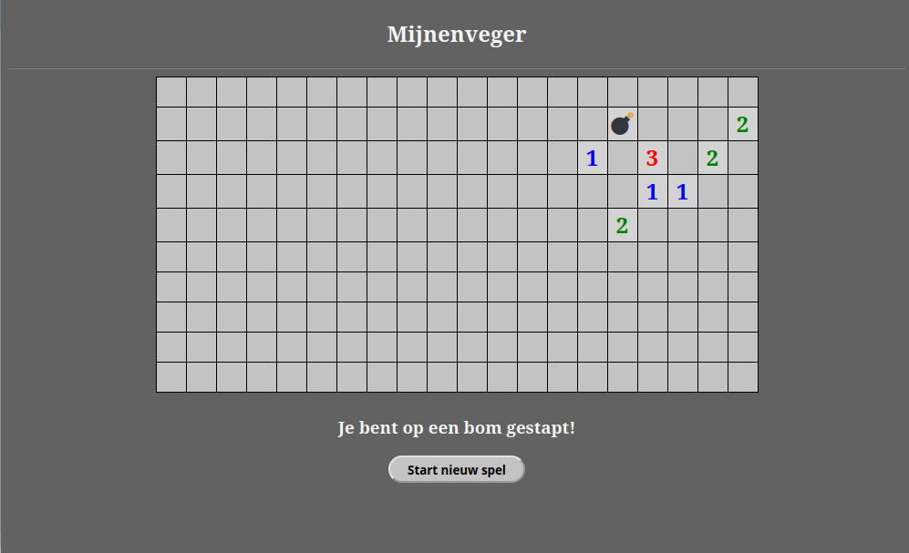

# Mijnenveger

Je gaat het spel **Mijnenveger** maken. Wij hebben het spel voorbereid, maar het is nog niet af. Als je alle opdrachten hebt uitgevoerd, heb je een werkende versie van Mijnenveger.

## Het spel Mijnenveger
Mijnenveger, in het Engels Minesweeper genaamd, is een spel dat bestaat uit een veld met gesloten vakjes. Onder sommige vakjes zit een bom verstopt. Doel van het spel is alle vakjes op het veld te openen waar geen bom ligt. De allereerste zet klik je een vakje in het mijnenveld open en kun je alleen maar hopen dat er geen bom onder zit. Als er geen bom zit, kan er een nummer verschijnen in het vakje. Dit nummer geeft het aantal aangrenzende vakjes weer waar een bom onder verstopt zit. Bijvoorbeeld: Als in een vakje het getal 2 staat, ligt dat vakje tegen 2 andere vakjes aan (recht of schuin) waaronder een bom verstopt is. De kunst van het spel is om gebruik te maken van die nummers en zo te proberen om uit te vinden onder welk vakje een bom ligt. Dat vakje moet je dus niet openen. Open je een vakje met een bom eronder, dan is het spel afgelopen.

De moeilijkheidsgraad van het spel is afhankelijk van het aantal vakjes in het speelveld en de hoeveelheid bommen die erin verstopt zijn. 

Het uiteindelijke spel komt er uit te zien als in de afbeelding hieronder.  

## Wat ga je doen
Je gaat het spel af maken en ook op onderdelen wat mooier. Maar, in de opdrachten hebben we niet alles voor je uitgewerkt. We verwachten dat je zelf zaken uitzoekt. Dat maakt het wel iets moeilijker. Als je iets niet weet, ga dan eerst zelf (bijvoorbeeld met Google) op zoek naar het antwoord of overleg met iemand die dit spel ook maakt. Als je helemaal vast komt te zitten, dan mag je uiteraard hulp vragen aan een van de begeleiders (of stiekem bij de oplossing kijken).

Op elke pagina welke hierna volgt, vind je een stukje uitleg en daarin een of meer opdrachten die jij zelf moet doen. Een opdracht herken je doordat de regel begint met ▶▶▶

Onderaan elke pagina's vind je links waar je op kunt klikken. Als je klikt op de **Start** keer je altijd terug naar deze pagina
  

Klik nu <a href="./mijnenveger-opdracht0.md">hier</a> voor de eerste opdracht (instellen van de werkomgeving).

