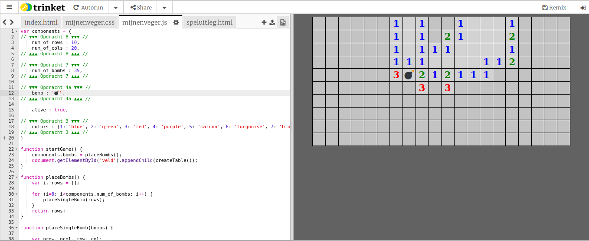
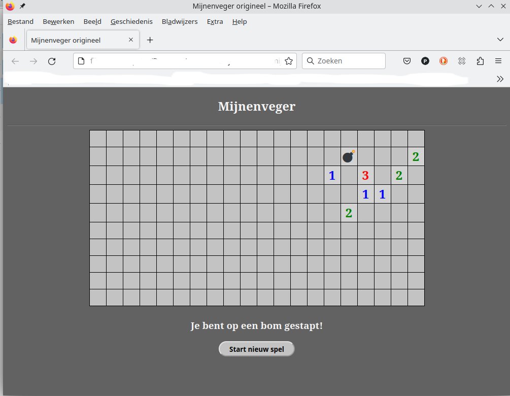

# Opdracht 0: De werkomgeving

De code waarin je gaat werken, staat in *Trinket*. *Trinket* is een website waarop je in de linker helft van het scherm kan programmeren en in de rechter helft van het scherm direct het resultaat ziet van wat je hebt aangepast.  

Na het openen moet je aan de linker kant code zien en aan de rechter kant een pagina met het spel Mijnenveger. Maar, helaas is het spel nog niet af en zie je alleen nog maar een grijs vlak.

Als je aan de linker kant de code aanpast, dan verandert de webpagina automatisch na een paar seconden aan de rechterkant. 

 > Wordt na het aanpassen van je code de rechterkant van de pagina zwart, dan heb je waarschijnlijk een typefout gemaakt. Die fout moet je eerst oplossen voor je verder kunt gaan met de volgene opdracht!

 
Het uiteindelijke spel komt er uit te zien als in de afbeelding hiernaast getoond.  
 
Als je je *Trinket* werkomgeving geopend hebt, begint het echte werk! 
     

<b>▶▶▶ Klik nu op <a href="https://trinket.io/embed/html/xxxxxxxxxxxx" target="_blank">*Trinket*</a> om je werkomgeving te openen.</b?>   

<a href="./Instructies.md">Start</a>&emsp; 
|&emsp;<a href="./mijnenveger-opdracht1.md">Opdracht 1</a>

