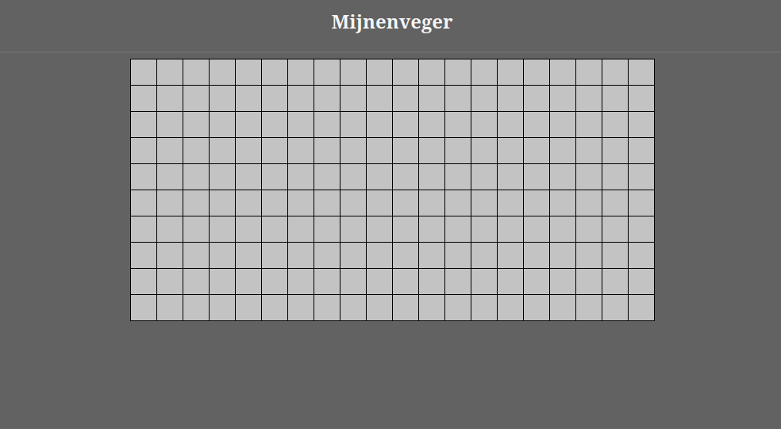

# Opdracht 2: De eerste schreden

Klik maar eens wat rond op het speelscherm. Je zult zien dat er wel wat gebeurd als je op sommige plekken op het scherm klikt. Maar hoe weet je waar je precies moet klikken? Geen idee, dat kunnen we nu niet zien.

Het mijnenveld en de afzondelijke vakjes, worden gemaakt door een tabel. Om die zichtbaar te maken, gaan we de afzonderlijke tabel cellen voorzien van een rand.

De tabelopmaak code (CSS) staat in het bestand `mijnenveger.css` 

▶▶▶ Zoek *Opdracht 2* op in het bestand `mijnenveger.css` en verander de code dusdanig dat de vakjes een zichtbare rand van 1 pixel breed krijgen, zodat het scherm er uit ziet als in de afbeelding.

 
  
Probeer eerst zelf het antwoord te vinden voor je het opzoekt of controleert.

  
Oplossing 2

>  #veld table td {  
    &emsp;background-color: rgb(195, 195, 195);  
    &emsp;width: 30px;  
    &emsp;min-width: 30px;  
    &emsp;height: 30px;  
    &emsp;min-height: 30px;  
    &emsp;**border: 1px solid black;**      
}  

Herstart nu het spel door toets F5 te drukken. Beter zo?

&emsp;<a href="./mijnenveger-opdracht1.md">Opdracht 1</a>
&emsp;<a href="./Instructies.md">Start</a> 
&emsp;<a href="./mijnenveger-opdracht3.md">Opdracht 3</a>

