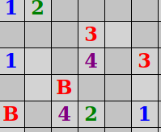

# Opdracht 3: Het spel krijgt kleur

Als je een vakje open klikt, kan het volgende gebeuren.  

 + Er ligt een bom. Het spel is direct afgelopen
 + Het vakje wordt als enige geopend en bevat een cijfer
 +Als aangrenzend geen vakjes met bommen liggen, worden meerdere veilige vakjes grijs en de vakjes aan de buitenzijde van het geopende vlak welke wel aan een bom grenzen zijn gevuld met een cijfer.
 
 Weet jij hoeveel bommen maximaal tegen 1 vakje aan kunnen liggen? 
 
Klik hier voor het antwoord
Aan 1 vakje grenzen maximaal 8 andere vakjes, dus heb je de cijfers 1 t/m 8 nodig
 

Het maximum aantal vakjes dat kan grenzen aan een vakje bepaalt het aantal cijfers wat je nog nodig hebt. De kans dat je de hoogste cijfers tegenkomt is klein, maar niet onmogelijk.

De cijfers zijn nu nog allemaal grijs. Het is mooier als we wat kleur in het spel brengen. Je gaat elk cijfer zijn eigen kleur geven.

De kleuren voor de cijfers staan, in tegenstelling wat je misschien verwacht, niet in het opmaakbestand (CSS). Ze worden in dit spel in de JavaScript code toegewezen.

▶▶▶ Zoek *Opdracht 3* op in het bestand `mijnenveger.js` en verander de code dusdanig dat elk cijfer een kleur krijgt. Bijvoorbeeld zoals hieronder is aangegeven, maar je mag ook zelf je eigen kleuren kiezen. 

 

1. blauw
2. groen
3. rood
4. paars
5. kastanjebruin (bijna rood)
6. turkoois
7. zwart
8. grijs

Als je wat hulp nodig hebt bij het vinden van de namen voor kleuren, kijk dan op deze	[Kleurenlijst](https://nl.wikipedia.org/wiki/Lijst_van_HTML-kleuren) op Wikipedia.	

  
Oplossing 3

>  var components = { 
    &emsp;num_of_rows : 10, 
    &emsp;num_of_cols : 20, 
    &emsp;num_of_bombs : 35, 
    &emsp;bomb : 'B', 
    &emsp;alive : true, 
    &emsp;**colors : {1: 'blue', 2: 'green', 3: 'red', 4: 'purple', 5: 'maroon', 6: 'turquoise', 7: 'black', 8: 'grey'}** 
}

Herstart nu het spel door toets F5 te drukken en bekijk het effect van je kleurenkeuze. 

Als je tevreden bent, ga dan verder met opdracht 4.

&emsp;<a href="./mijnenveger-opdracht2.md">Opdracht 1</a>
&emsp;<a href="./Instructies.md">Start</a> 
&emsp;<a href="./mijnenveger-opdracht4.md">Opdracht 4</a>

