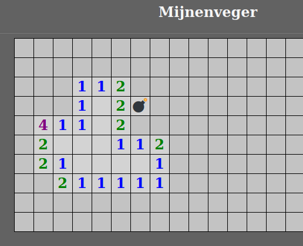

# Opdracht 4: Een afbeelding voor de bom

Tot nu toe zag je de letter B als er een bom onder een vakje lag. Het oogt veel leuker als we een plaatje met een bom laten zien i.p.v. een letter. Daar ga jij in deze opdracht voor zorgen.

Dat doen we door een karakterset te gebruiken waarin ook een karakter zit met een afbeelding van een bom. Karakter is een ander woord voor een letter, cijfer of leesteken. Als je graag iets meer wilt weten hoe dat zit met karakters in je computer, lees dan de uitleg over karaktersets. Wil je dat niet weten ga dan gewoon verder met de opdracht.

 
uitleg over karaktersets

In een computer kun je heel veel karakters (cijfers, letters, leestekens) gebruiken. Kijk maar eens op je toetsenbord hoeveel verschillende karakters op alle toetsen staan.

Een computer weet niet dat je een A bedoelt, ook al druk je op de toets met een A erop. Niet alle computers hebben dezelfde toetsenbord indeling. Als je op een toets drukt, maakt de computer er ook niet direct een A van, maar geeft een getal. Dat dat getal een A wordt, daarvoor zorgt Windows (maar ook Linux en alle andere besturingssystemen). Welk karakter hoort dan bij wel getal? Dat bepaalt de karakterset welke is ingesteld. Want er zijn meer karaktersets. Een karakterset is voor te stellen als een grote tabel van cijfers waarachter het bijbehorende karakter afgebeeld staat.

In het allereerste begin van de computer was het voldoende om de standaard gebruikte letters, cijfers en leestekens te kunnen afbeelden en was de meest gebruikte karakterset ASCII (zoek maar eens op Internet als je hier meer over wilt weten). ASCII gebruikt 7 bits uit 1 computer byte, maar kan daarom maar 128 karakters bevatten. Omdat mensen al gauw erachter kwamen dat veel meer karakters kunnen gebruiken nodig is, onder andere om ook internationale (bijvoorbeeld Chinese of Hebreeuwse) karakters te kunnen weergeven, zijn er nieuwe karaktersets bedacht. Voor mijnenveger gebruiken wij karakterset UTF-8. Met UTF-8 kunnen maximaal 1,112,064 karakters worden gebruikt. Zoveel hebben wij er gelukkig niet nodig voor mijnenveger.

Er is nog veel meer te vertellen over karaktersets, maar dat zou voor nu waarschijnlijk teveel informatie zijn. Dit was al veel informatie.
  

De bom is een speciaal karakter. Die vind je niet direct op je toetsenbord terug, dus moet je wat extra handelingen verrichten om de bom te verkrijgen. Afhankelijk van welk besturingssysteem je gebruikt, zijn er sneltoetsen om de speciale karakters te verkrijgen.

In Windows: druk ALT + . (toets met punt) tegelijk in. Zoek de bom en voeg deze in.

In Linux: druk ctrl + shift + u tegelijk in en zonder wat anders te doen, type daarna 1F4A3 in gevolgd door de enter (of return) toets. De bom wordt ingevoegd.

In MacOS: druk command + control + space. Zoek de bom en voeg deze in.

▶▶▶ Zoek *Opdracht 4a* op in het bestand `mijnenveger.js` en verander de letter B in een afbeelding van een bom met behulp van de bovengenoemde toetsencombinatie voor het door jou gebruikte  besturingssysteem.

  
Oplossing 4a

  Gebruik de toetsencombinatie die hoort bij het door jou gebruikte besturingssysteem en voeg de bom in op de plek waar nu de B staat.
> bomb : '💣',

Herstart nu het spel door op F5 te drukken en zoek maar snel een vakje met een bom op ...... 

WAT... Geen bom? Wel een paar rare karakters. Hoe kan dat nu? We hebben toch zojust zelf de bom wel degelijk in `mijnenveger.js` gezet toch? Maar dat je geen bom ziet, ligt niet aan jou. Dat komt omdat we een karakterset gebruiken die geen bom karakter bevat. Geen zorgen, we gaan je helpen om dat te fixen.

▶▶▶ Zoek *Opdracht 4b* op in het bestand `index.html` en zorg dat karakterset UTF-8 gebruikt wordt. Lukt dat niet, mag je spieken bij de oplossing

Oplossing 4b

&lt;meta http-equiv="content-type" content="text/html;<b>charset=UTF-8</b>"&gt;

Herstart nu het spel door toets F5 te drukken en zoek maar snel een vakje met een bom op ...... 

Als je tevreden bent, ga dan verder met opdracht 5.

&emsp;<a href="./mijnenveger-opdracht2.md">Opdracht 3</a>
&emsp;<a href="./Instructies.md">Start</a> 
&emsp;<a href="./mijnenveger-opdracht4.md">Opdracht 5</a>

